# Índice.

[1. Organización de ficheros de la tienda.](#1)

[2. Actualización de sistema e instalación de docker.](#2)

[3. Configuración de entorno Docker.](#3)

[4. Instalación y configuración de la base de datos.](#4)

[5. Comprobación del funcionamiento.](#5)

   

# Organización de ficheros de la tienda.

Tendremos diferentes carpetas en las que tendremos los ficheros que necesitaremos para nuestro MVC (ModeloVistaControlador):

- Carpeta DB: En esta carpeta encontraremos el fichero db.php que se encargará de realizar la conexión con la base de datos.

  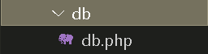

- Carpeta CONTROLLERS: En esta carpeta encontraremos los controladores de los productos y el usuario. Contiene el código necesario para responder a las acciones que se solicitan en la aplicación, como visualizar un elemento, realizar una compra, etc. Se puede decir que hace de enlace entre las vistas y los modelos, respondiendo a los mecanismos que puedan requerirse para implementar las necesidades de nuestra aplicación.

  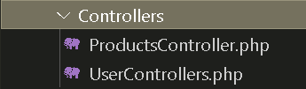

- Carpeta MODELS: Es la capa donde se trabaja con los datos, por tanto, contendrá mecanismos para acceder a la información y también para actualizar su estado. Los datos los obtendremos de nuestra base de datos, por lo que en los modelos tendremos todas las funciones que accederán a las tablas y harán los correspondientes selects, deletes, inserts, etc.

  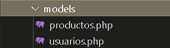

- Carpeta VIEWS: Las vistas, como su nombre nos hace entender, contienen el código de nuestra aplicación que va a producir la visualización de las interfaces de usuario, o sea, el código que nos permitirá renderizar los estados de nuestra aplicación en HTML. En las vistas nada más tenemos los códigos HTML y PHP que nos permite mostrar la salida.

  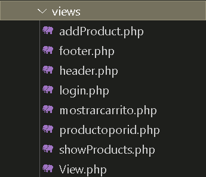

- Archivo INDEX.php: Nuestro index será la página inicial de nuestra tienda. En el se mostrará nuestro header donde tenemos todas las acciones que se pueden realizar y mediante una comprobación, haremos que de primeras se muestre una pagina inicial pero cuando se accione un botón del header nos mande al controlador necesario para esa acción.

  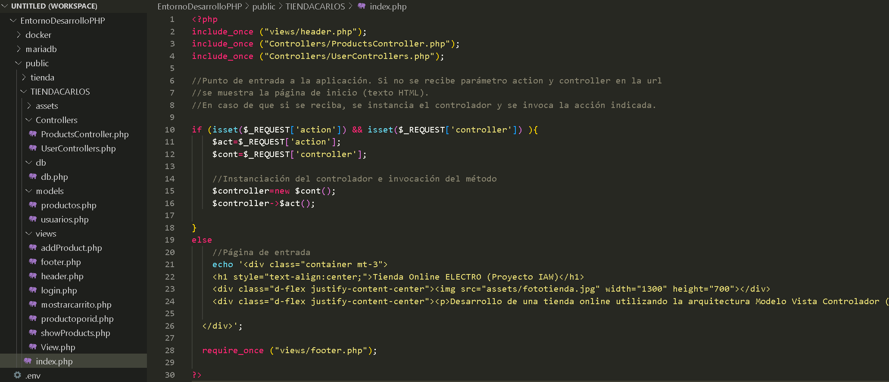

 

# Actualización de sistema e instalación de docker.

Empezaremos actualizando el sistema mediante los comandos **apt update** y **apt upgrade**. Una vez se haya actualizado nuestro sistema, instalaremos el paquete "docker-compose" con el comando **apt install -y docker-compose**.

  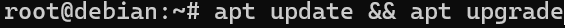

  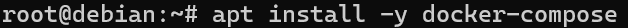

 

# Configuración de entorno Docker.

Primero crearemos un repositorio de nuestro Entorno de Desarrollo PHP en GitHub y lo clonaremos en nuestra máquina.

  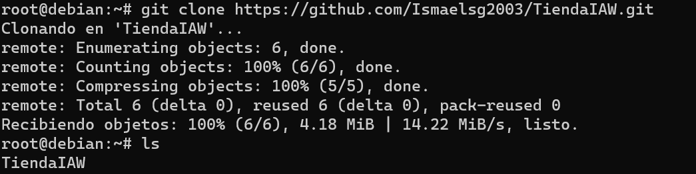

Una vez creada la carpeta de nuestro Entorno de Desarrollo ejecutaremos el comando **docker compose up -d** para levantar el entorno.

 

# Instalación y configuración de la base de datos.

Primero tendremos que instalar el **default-mysql-server** y **mariadb-client**. Para crear nuestra base de datos nos iremos a HeidiSQL, donde tenemos la base de datos con la que hemos estado trabajando. Exportaremos esta base de datos y la mandaremos a nuestra máquina virtual.

  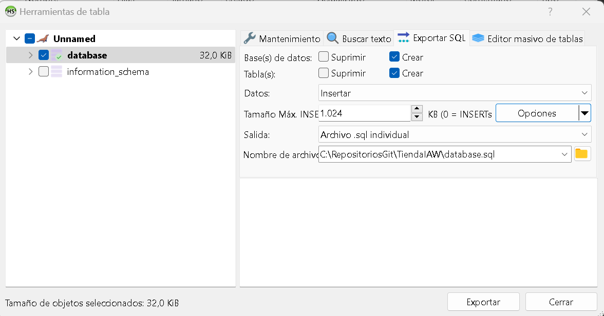

En nuestra máquina virtual, con **docker inspect entornodesarrollophp\_mariadb\_1** podremos ver la IP que tiene nuestro contenedor de base de datos. Una vez tengamos la IP ejecutaremos el comando **mysql -u root -p -h 172.19.0.2 < basededatos.sql** con el que importaremos nuestra base de datos al contenedor de base de datos.

  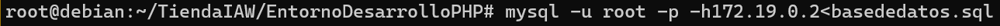

 

# Comprobación del funcionamiento.

Una vez configurada la máquina, nos iremos al navegador y buscaremos el dominio del servidor: **informatica.iesalbarregas.com:14001**. El puerto dependerá del que tenga asignado el alumno.

  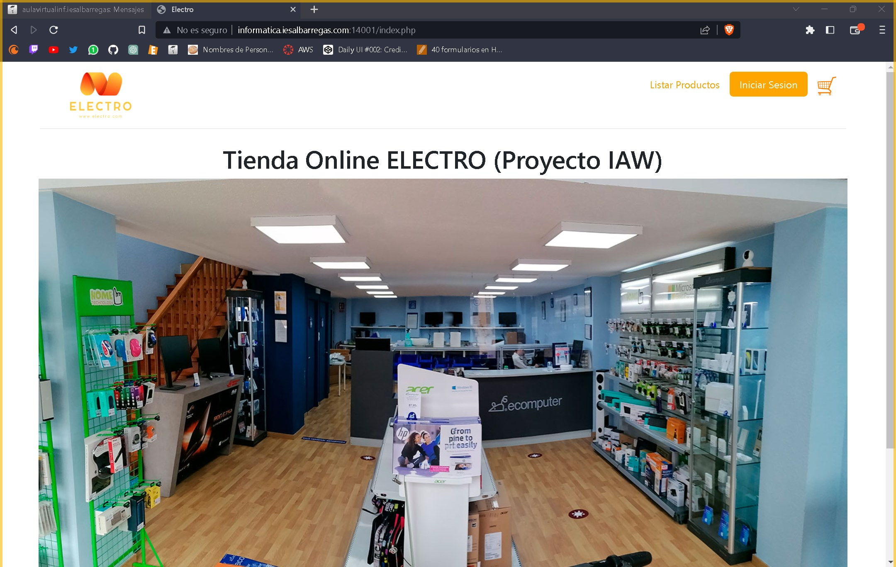

